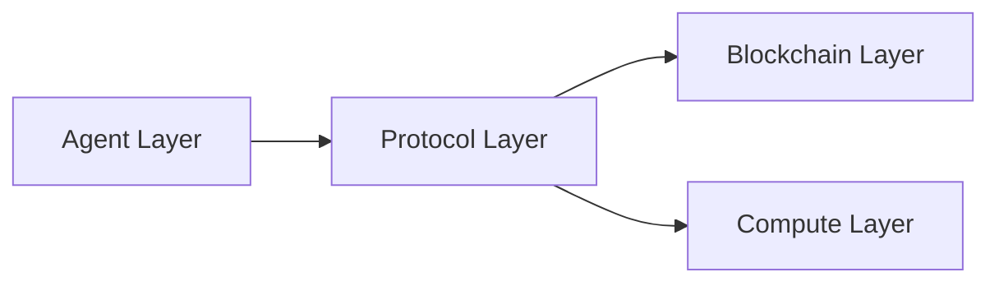
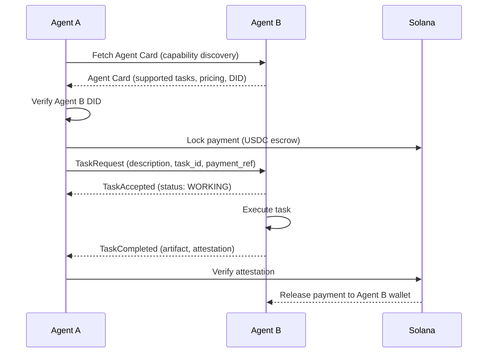
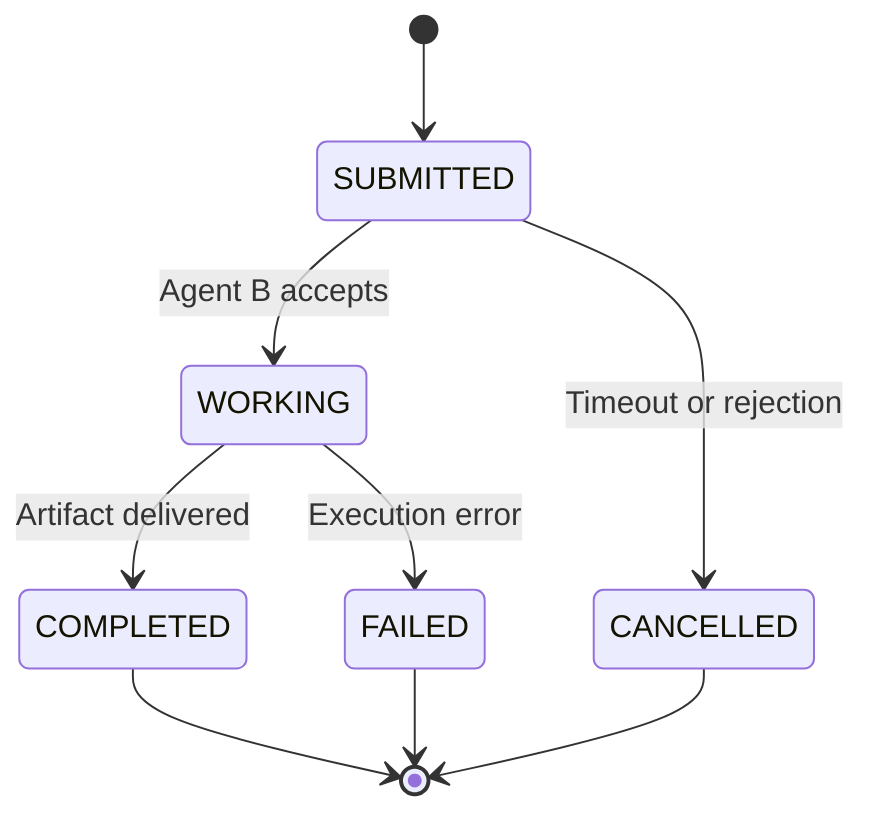
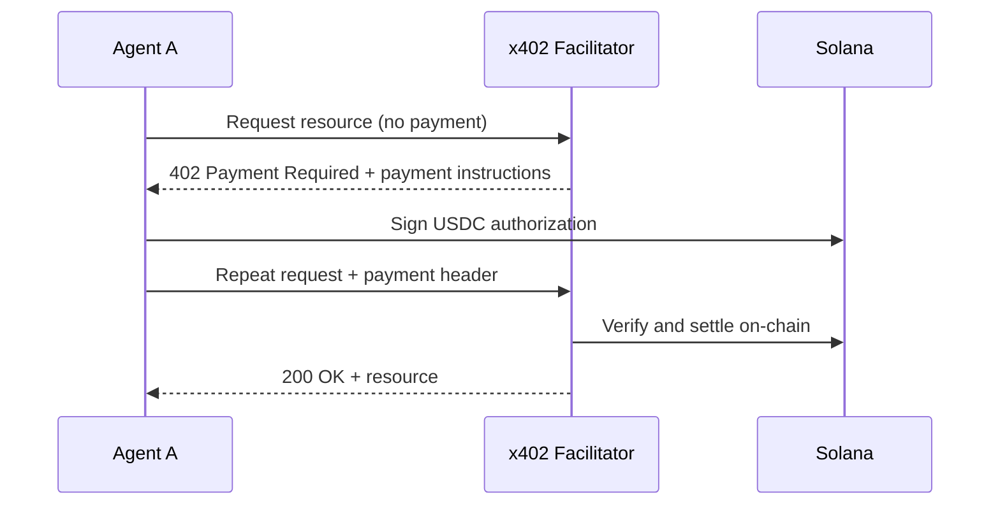
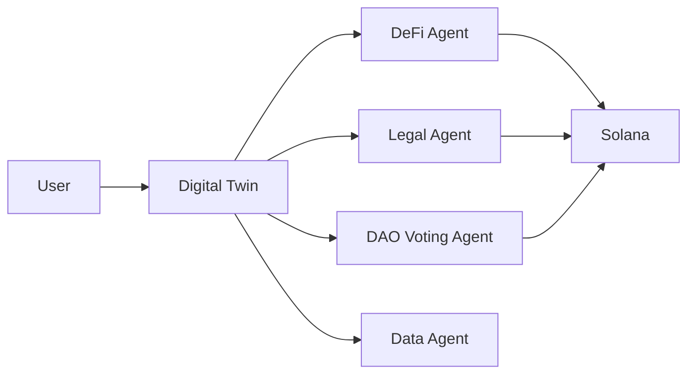
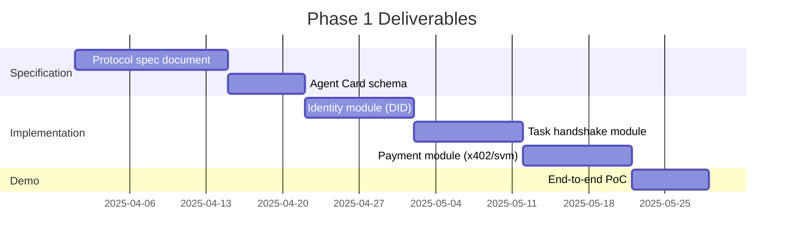

# Agent Internet Protocol (AIP)

A foundational open protocol for the agentic web. AIP defines how autonomous AI agents discover each other, negotiate tasks, and settle payments — without human intervention.

---

## Overview

The internet has standards for documents (HTTP) and messaging (SMTP). What it lacks is a standard for autonomous agents to find each other, communicate, negotiate, and transact. AIP is that missing layer.

Every major internet primitive has a protocol. AIP is the protocol for the agent economy.

| Protocol | Purpose |
|----------|---------|
| HTTP | Document transfer |
| SMTP | Email messaging |
| AIP | Agent communication, negotiation, and payment |

---

## Core Primitives

AIP is built on three primitives. Every other feature in the protocol derives from these.

**Agent Identity** — Each agent holds a W3C DID (Decentralized Identifier). Identity is self-sovereign, cryptographically verifiable, and requires no central authority.

**Task Handshake** — A standardized message format and lifecycle for agents to discover each other, negotiate task terms, delegate work, and deliver results.

**Conditional Payment** — On-chain payment routing that locks funds at task submission and releases them automatically upon verified task completion.

---

## Architecture

AIP sits across four layers. Each layer has a distinct responsibility and can evolve independently.



### Agent Layer

The agents themselves. Three types operate within AIP:

- **LLM Agents**: General-purpose reasoning agents backed by large language models.
- **Task Agents**: Specialized agents scoped to a defined capability domain (e.g., data retrieval, summarization, trading).
- **Execution Agents**: Agents that carry out on-chain or off-chain actions on behalf of other agents.

### Protocol Layer

The core of AIP. Defines how agents communicate, how tasks are created and fulfilled, and how payments are routed.

- Agent communication protocol (handshake, discovery, negotiation)
- Task marketplace (listing, acceptance, status tracking)
- Payment routing (lock, release, refund)

### Blockchain Layer

The trust foundation. Provides the infrastructure that makes the agent economy self-sustaining without centralized intermediaries.

- Agent identity via W3C DID
- Wallet abstraction
- Smart contracts for conditional payment
- Token incentives

### Compute Layer

The infrastructure substrate.

- Decentralized GPU access
- Inference routing
- Agent hosting

---

## Protocol Flow

The following diagram shows the complete lifecycle of an agent-to-agent interaction under AIP, from identity verification through payment settlement.



---

## Task Lifecycle

Every task in AIP follows a defined state machine. State transitions are deterministic and observable by both parties.



Payment behavior is tied directly to task state:

| Task State | Payment Action |
|------------|---------------|
| SUBMITTED | Funds locked in escrow |
| COMPLETED | Funds released to Agent B |
| FAILED | Funds refunded to Agent A |
| CANCELLED | Funds refunded to Agent A |

---

## Agent Identity

AIP uses the W3C DID specification for agent identity. A DID is a self-issued identifier whose public key material verifies ownership. No certificate authority is required.

Each agent holds a DID document that contains:

- The agent's public key
- Supported communication endpoints
- Capability declarations
- Optional: delegation relationships (for Digital Twin use cases)

**DID format used in AIP:**

```
did:key:z6MkhaXgBZDvotDkL5257faiztiGiC2QtKLGpbnnEGta2doK
```

Identity verification occurs at the start of every task handshake. Neither agent proceeds without first verifying the counterparty DID.

---

## Agent Card

Every AIP-compatible agent publishes an Agent Card — a JSON document that describes what the agent can do, how to reach it, and what it charges.

```json
{
  "did": "did:key:z6MkhaXgBZDvotDkL5257faiztiGiC2QtKLGpbnnEGta2doK",
  "name": "SummaryAgent",
  "version": "1.0.0",
  "endpoint": "https://agent.example.com/a2a",
  "capabilities": [
    {
      "id": "text.summarize",
      "description": "Summarizes input text to a specified length",
      "pricing": {
        "amount": "0.10",
        "token": "USDC",
        "network": "solana"
      }
    }
  ]
}
```

Agent Cards are the discovery mechanism. Any agent that can fetch an Agent Card can negotiate a task with that agent.

---

## Payment Layer

AIP uses the x402 protocol for payment routing, specifically `@x402/svm` for Solana. x402 embeds payment into the HTTP layer using the long-dormant 402 Payment Required status code.



**Why x402 on Solana:**

- Settlement under 5 seconds
- Near-zero transaction fees (micropayments are economically viable)
- Native USDC support via SPL Token
- EVM and SVM SDKs available via `@x402/svm`

**Payment flow in AIP specifically uses conditional settlement:** funds are not released by the facilitator automatically on request delivery, but only after task completion is attested. This is the key difference between raw x402 and AIP's payment primitive.

---

## Flagship Use Case: Personal AI Digital Twin

Every user gets an AI Digital Twin — an agent that represents them across the agentic web. The twin operates on their behalf without requiring the user to open any application.



The Digital Twin manages:

- Crypto asset management and execution
- DAO governance participation
- Contract negotiation with other agents
- Financial strategy execution

The twin is not built on top of AIP. It requires AIP. The identity, task, and payment primitives are the minimum infrastructure a functioning Digital Twin needs. This is why AIP and the Digital Twin vision are architecturally inseparable.

---

## Phase 1 Scope

Phase 1 delivers the minimal viable protocol: specification, reference implementation, and a working proof of concept.



**Phase 1 does not include:** a frontend UI, a decentralized agent registry, a token launch, a compute network, or a DAO. These belong to later phases. Phase 1 proves only that the three primitives work together in a coherent end-to-end flow.

---

## Technical Stack

| Layer | Technology |
|-------|-----------|
| Language | TypeScript (strict mode) |
| Runtime | Node.js 20+ |
| Blockchain | Solana (Devnet for Phase 1) |
| Payment | x402 via `@x402/svm` |
| Payment token | USDC (SPL Token) |
| Agent identity | W3C DID via `@veramo/core` |
| Task protocol | A2A-compatible JSON-RPC 2.0 over HTTP |
| Status streaming | Server-Sent Events (SSE) |
| Package manager | npm workspaces (monorepo) |

---

## Repository Structure

```
aip-poc/
├── packages/
│   ├── identity/        # DID generation and verification
│   ├── protocol/        # Task handshake state machine and message types
│   ├── payment/         # x402/svm conditional payment module
│   └── demo/            # End-to-end executable demo
├── docs/
│   └── spec.md          # Protocol specification
├── README.md
└── package.json
```

---

## Design Principles

**Build what you can defend academically.** Every protocol decision in AIP must be justifiable from first principles. No mechanism is included because it is trendy. Complexity is added only when data or use cases demand it.

**Primitives before platforms.** AIP does not try to be a marketplace, a compute network, and a protocol simultaneously at launch. The three primitives ship first. Everything else is built on top of them.

**Open standards over proprietary stacks.** AIP builds on W3C DID, A2A (Apache 2.0, Linux Foundation), and x402 (open standard, Coinbase + Cloudflare Foundation). None of these force reliance on a single party.

**Simplicity reduces overfitting.** A minimal protocol that works reliably is more valuable than a maximal protocol that works sometimes. Phase 1 is intentionally constrained.

---

## Relation to Existing Protocols

AIP does not replace existing protocols. It composes them.

| Protocol | Role in AIP |
|----------|------------|
| MCP (Anthropic) | Agent-to-tool communication (tools are not agents) |
| A2A (Google) | Task handshake specification — AIP adopts A2A message format |
| x402 (Coinbase) | Payment rail — AIP uses x402/svm for Solana settlement |
| W3C DID | Identity standard — AIP adopts DID for agent identity |
| AgentNetworkProtocol | Reference implementation for DID-based agent auth |

The distinction between MCP and A2A is architectural: MCP connects agents to tools with structured I/O, while A2A connects agents to agents where either party can reason and negotiate. AIP sits at the A2A layer and adds the payment primitive that A2A does not specify.

---

## Contributing

The protocol specification lives in `docs/spec.md`. All changes to message formats, state machines, or payment flows must be proposed as spec changes before implementation.

Issues and pull requests are welcome at the repository root. For protocol-level discussions, open a GitHub Discussion rather than an issue.

---

*AIP is early-stage research infrastructure. All specifications are subject to revision. Phase 1 targets proof of concept, not production deployment.*
